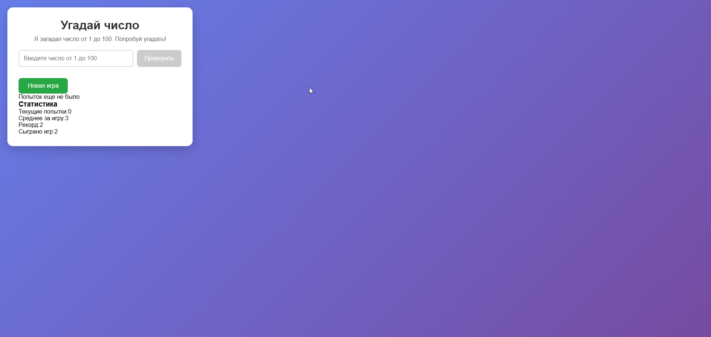
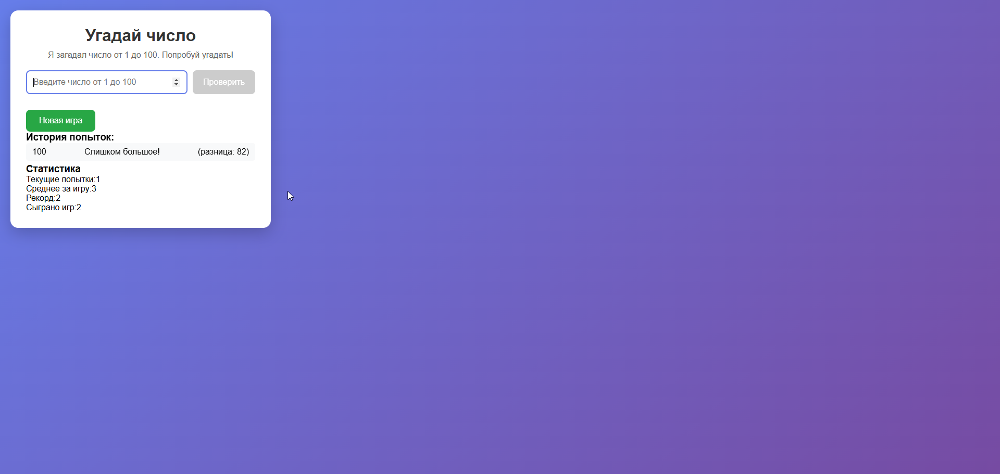
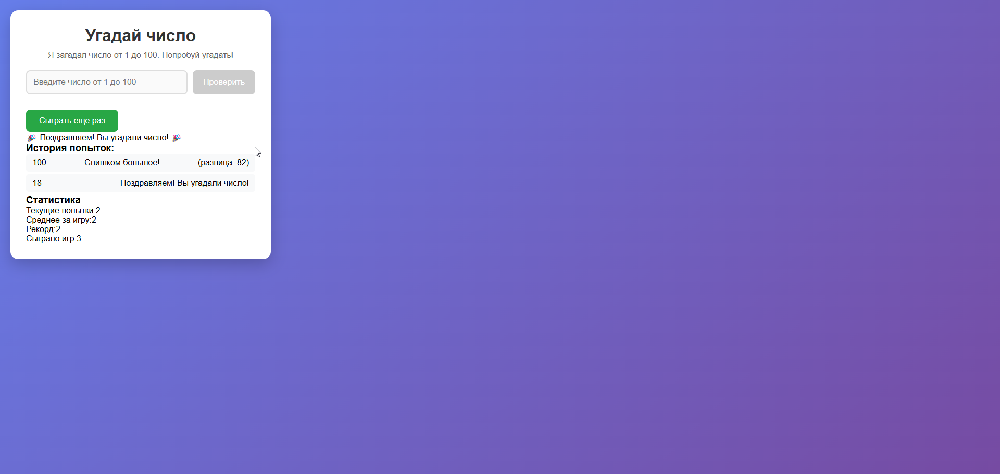

# Мини-игра "Угадай число"
React-приложение для игры в угадывание случайного числа с сохранением статистики и истории попыток.

## Возможности
### Угадывание числа от 1 до 100

### Интеллектуальные подсказки ("слишком большое/маленькое")

### Подробная статистика игр

### История всех попыток

### Автосохранение прогресса в localStorage

### Адаптивный дизайн

### Быстрая перезагрузка игры

# Скриншоты

# Быстрый старт
Предварительные требования
Node.js (версия 14 или выше)

npm или yarn

Установка и запуск
Клонируйте репозиторий (или создайте файлы вручную)

Установите зависимости:

bash
npm install
Запустите приложение:

bash
npm start
Откройте браузер и перейдите по адресу:

text
http://localhost:3000
🛠 Сборка для production
bash
npm run build
Собранные файлы будут находиться в папке build/.

# Структура проекта
text
src/
├── components/           # React-компоненты
│   ├── Game.js          # Главный компонент игры
│   ├── GuessInput.js    # Компонент ввода числа
│   ├── GuessHistory.js  # История попыток
│   ├── GameStats.js     # Статистика игры
│   └── RestartButton.js # Кнопка перезапуска
├── hooks/               # Кастомные React-хуки
│   └── useLocalStorage.js # Хук для работы с localStorage
├── utils/               # Вспомогательные функции
│   └── gameLogic.js     # Логика игры
├── App.js               # Корневой компонент
├── App.css              # Стили приложения
└── index.js             # Точка входа
# Как играть
Приложение загадывает случайное число от 1 до 100

Введите ваше предположение в поле ввода

Получайте подсказки: "Слишком большое" или "Слишком маленькое"

Продолжайте угадывать, пока не найдете правильное число

После победы можно начать новую игру

# Статистика
Приложение отслеживает:

Количество попыток в текущей игре

Среднее количество попыток за все игры

Рекорд (минимальное количество попыток)

Общее количество сыгранных игр

# Технологии
React 18 - Библиотека для построения пользовательских интерфейсов

Hooks - useState, useEffect, useCallback, кастомные хуки

Local Storage - Сохранение данных между сессиями

CSS3 - Современные стили и анимации

ES6+ - Современный JavaScript

# Особенности реализации
Компонентная архитектура
Приложение разделено на переиспользуемые компоненты с четкими responsibilities:

Game - управление состоянием игры

GuessInput - обработка пользовательского ввода

GuessHistory - отображение истории попыток

GameStats - показ статистики

RestartButton - управление перезапуском игры

Управление состоянием
javascript
const [targetNumber, setTargetNumber] = useState(generateRandomNumber());
const [history, setHistory] = useState([]);
const [gameCompleted, setGameCompleted] = useState(false);
Кастомные хуки
javascript
// useLocalStorage.js - синхронизация состояния с localStorage
const [value, setValue] = useLocalStorage('key', initialValue);
Обработка событий
Формы с предотвращением стандартного поведения

Валидация пользовательского ввода

Оптимизированные колбэки с useCallback

# Скрипты
npm start - Запуск development сервера

npm run build - Сборка production версии

npm test - Запуск тестов

npm run eject - Извлечение конфигурации (необратимо)

# Кастомизация
Вы можете легко изменить настройки игры в файле src/utils/gameLogic.js:

javascript
// Изменение диапазона чисел
export const generateRandomNumber = (min = 1, max = 1000) => {
  return Math.floor(Math.random() * (max - min + 1)) + min;
};
# Разработка
Добавление новых функций
Создайте компонент в папке components/

Добавьте необходимую логику в utils/gameLogic.js

Импортируйте и используйте в основном компоненте Game.js

Стилизация
Стили находятся в App.css и используют CSS-классы для каждого компонента.

# Браузерная поддержка
Chrome 90+

Firefox 88+

Safari 14+

Edge 90+

# Известные проблемы
При очистке localStorage статистика сбрасывается

В очень старых браузерах может не работать localStorage

# Лицензия
MIT License - можно свободно использовать для учебных целей.

Разработано для контрольной работы №4 по React